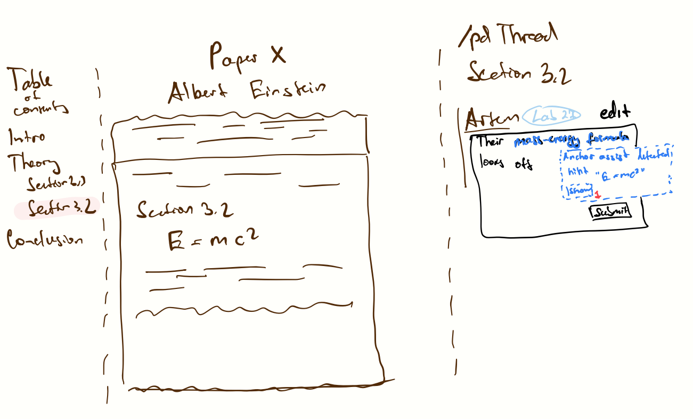
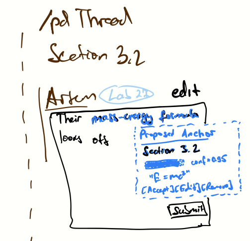
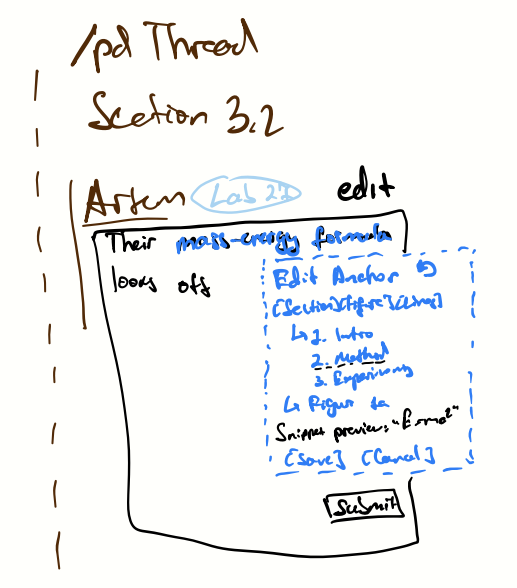
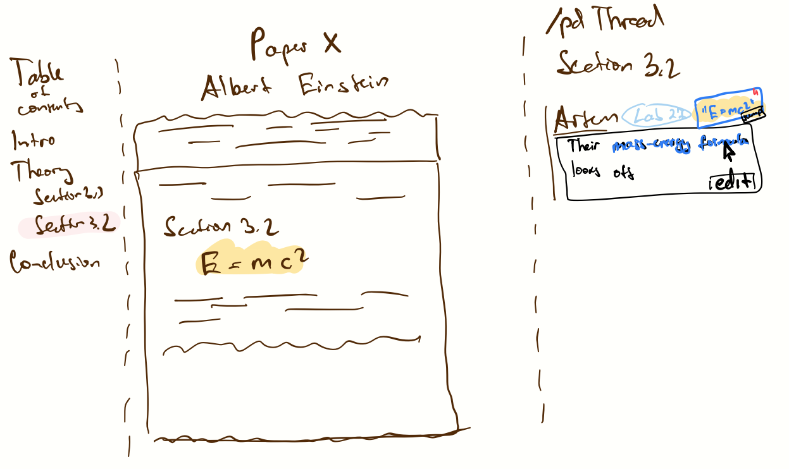

# PubDiscuss – AnchorAssist (A3)
This repo now includes AnchorAssist, an AI augmentation for `AnchoredContext` that turns fuzzy hints like “see Fig. 3b” or a pasted quote into a precise `AnchorRef` (`Section` | `Figure` | `Lines`). The LLM proposes an anchor plus a short snippet and confidence; validators catch plausible errors (out-of-range lines, mismatched kind, hallucinated section/figure).

## Concept: AnchorAssist (Augmented AnchoredContext)

**Purpose**: Turn hints into precise anchors for posts/replies  
**Principle**: Users can enter anchors manually, or accept/modify LLM-proposed anchors before posting

### New LLM Action
- `inferAnchor(paperId, hintText, quote?) -> { anchor, snippet, confidence }`

### Validators
- Out-of-range `Lines` (page/line spans)
- Mismatched kind vs hint (Figure/Section/Quote)
- Low confidence requires confirmation

## A3 Deliverables (specs and journey in README)

### Original Concept Spec (AnchoredContext) — unchanged
- State:
  - `AnchorRef = Section{name, index?} | Figure{id} | Lines{page, lineStart, lineEnd}`
- Actions:
  - `attachAnchor(postId, anchorRef)` — requires valid anchor fields; effect associates anchor with a post/thread
- Operational Principle:
  - Users can manually attach precise anchors to posts to ground discussion. No AI required for manual flow.

### AI-Augmented Concept (AnchorAssist)
- New LLM Action:
  - `inferAnchor(paperId, hintText, quote?) -> { anchor: AnchorRef, snippet: string, confidence: number }`
  - Requires: `paperId` exists; `hintText` non-empty
  - Effects: Proposes an anchor; does not mutate state. Front-end requests user confirmation when confidence is low.
- Added Operational Principle:
  - When a textual hint or quote is provided, the system may call an LLM to propose a precise `AnchorRef` that the user can accept or edit before posting. Low-confidence proposals require explicit confirmation.
- Validators (implemented):
  - Out-of-range `Lines` page/line bounds
  - Kind-vs-hint/quote mismatch
  - Low confidence detection (marks as needs confirmation)

## UX Sketches

> Four low-fidelity sketches showing the user flow.

  
*User types a hint (“mass-energy formula looks off”). AnchorAssist detects a reference and begins inferring an anchor.*

  
*LLM proposes an anchor — e.g., “Section 3.2 — E = mc²” — with snippet, confidence bar, and Accept / Edit / Remove controls.*

  
*User edits the proposal: choose Section / Figure / Lines, view snippet preview, and Save or Cancel. Inline validators mark errors.*

  
*Final post shows an anchor chip (“E = mc²”) linked back to that location in the paper. If not accepted, chip is omitted.*


### User Journey 

While viewing *Paper X* by Albert Einstein, Artem scrolls to **Section 3.2 $(E = mc^2)$** and opens a PubDiscuss thread.  
He types *“Their mass–energy formula looks off.”* — **AnchorAssist** detects the hint and begins inferring a location.  
A blue box appears showing **Proposed Anchor -> Section 3.2 — “$E = mc^2$”** with confidence 0.95.  
Artem clicks **Edit**, checks the section list and preview snippet, and presses **Save**.  
The post publishes with a small anchor chip **“$E = mc^2$”** linked back to the highlighted spot in the paper.  
Readers can click **Jump ->** to navigate directly to that equation in the paper viewer.

## Prerequisites

- **Node.js** (version 14 or higher)
- **TypeScript** (will be installed automatically)
- **Google Gemini API Key** (free at [Google AI Studio](https://makersuite.google.com/app/apikey))

## Quick Setup

### 0. Clone the repo locally and navigate to it
```cd pubdiscuss```

### 1. Install Dependencies

```bash
npm install
```

### 2. Add Your API Key

**Why use a template?** The `config.json` file contains your private API key and should never be committed to version control. The template approach lets you:
- Keep the template file in git (safe to share)
- Create your own `config.json` locally (keeps your API key private)
- Easily set up the project on any machine

**Step 1:** Copy the template file:
```bash
cp config.json.template config.json
```

**Step 2:** Edit `config.json` and add your API key:
```json
{
  "apiKey": "YOUR_GEMINI_API_KEY_HERE"
}
```

**To get your API key:**
1. Go to [Google AI Studio](https://makersuite.google.com/app/apikey)
2. Sign in with your Google account
3. Click "Create API Key"
4. Copy the key and paste it into `config.json` (replacing `YOUR_GEMINI_API_KEY_HERE`)

### 3. Run the Application

**Run AnchorAssist scenarios (3 scenarios × 3 prompt variants):**
```bash
npm start
```

**Run original DayPlanner demo (optional):**
```bash
npm run dayplanner
```

## File Structure

```
pubdiscuss/
├── package.json              # Dependencies and scripts
├── tsconfig.json             # TypeScript configuration
├── config.json               # Your Gemini API key (git-ignored)
├── gemini-llm.ts             # LLM wrapper
├── anchor-assist.ts          # AnchorAssist types, prompt, validators
├── anchor-assist-tests.ts    # 3 scenarios × 3 variants
├── dayplanner.ts             # Original sample (kept)
├── dayplanner-tests.ts       # Original sample tests (kept)
└── dist/                     # Compiled JavaScript output
```

## Scenarios

- T1: "Fig. 3b ablations" → expect `Figure: 3b`
- T2: Quoted sentence → expect `Lines` span
- T3: "Section 4 Limitations" → expect `Section` canonicalization

## Sample Output

```
--- Scenario: T1: Fig. 3b ablations | Variant: json
Result: Figure: 3b | conf=0.78
Snippet: …ablations for the main model…
```

## Key Features

- Precise `AnchorRef` proposals with confidence
- Three prompt variants to probe behavior
- Validators for realistic LLM mistakes

## Prompt Variants & Experiments (A3 requirement)

- Variants implemented:
  - `json` (strict JSON only)
  - `retrieve-then-localize` (reason over TOC/figures, then JSON)
  - `json-negative` (adds “do not hallucinate” constraints)
- Observations:
  - T1 (Fig. 3b): all variants converge on Figure 3b.
  - T2 (quote): enforcing “quote -> Lines” stabilized outputs across variants.
  - T3 (Section 4): JSON-only instruction eliminated non-JSON responses.
  - Remaining risk: ambiguity when sub-figures aren’t listed; mitigated by nudging to Lines with lower confidence.

## Config

Create `config.json`:
```json
{
  "apiKey": "YOUR_GEMINI_API_KEY_HERE"
}
```

## Troubleshooting

### "Could not load config.json"
- Ensure `config.json` exists with your API key
- Check JSON format is correct

### "Error calling Gemini API"
- Verify API key is correct
- Check internet connection
- Ensure API access is enabled in Google AI Studio

### Build Issues
- Use `npm run build` to compile TypeScript
- Check that all dependencies are installed with `npm install`

## Write-up

This repo includes:

- Spec file: `SPEC.md` (original + augmented specs, validators, variants, scenarios)
- Sketches placeholder: add `assets/anchor-assist-sketches/` with 2–3 annotated frames
- Brief user journey paragraph (in `SPEC.md` under UX)

You can also mirror content to your portfolio if desired, but per rubric the repo README/SPEC should stand alone for grading.

## Resources

- [Google Generative AI Documentation](https://ai.google.dev/docs)
- [TypeScript Documentation](https://www.typescriptlang.org/docs/)
